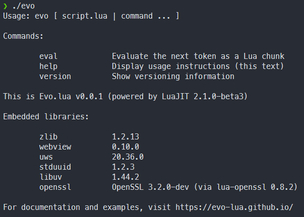
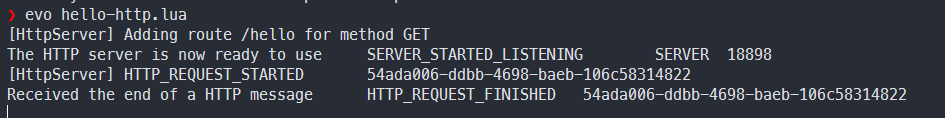
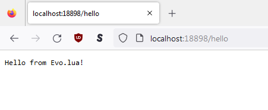

# Setup: Installation and Usage

Get started with Lua development using the Evo runtime

## Supported Platforms

The most commonly-used systems should have [binary releases available on GitHub](https://github.com/evo-lua/evo-runtime/releases):

- For Windows 10 and 11, download `evo.exe` from the releases page
- Mac OS users on an Intel-based machine can download `evo-macos-x64` (rename to `evo` after downloading, if you prefer)
- Linux (Debian/Ubuntu-likes) can try `evo-linux-x64` (rename to `evo`), though there may be incompatibilities

Alternatively, and likely preferably for Linux users, you can [build from source](/docs/how-to-guides/building-from-source) to obtain a fresh binary that way.

:::caution Linux users beware: glibc incompatibilities

Unfortunately, it's quite likely that you'll see some errors when trying to use the downloaded version from GitHub Releases:

```
evo: /lib/x86_64-linux-gnu/libc.so.6: version `GLIBC_2.34' not found (required by evo)
evo: /lib/x86_64-linux-gnu/libc.so.6: version `GLIBC_2.32' not found (required by evo)
evo: /lib/x86_64-linux-gnu/libc.so.6: version `GLIBC_2.33' not found (required by evo)
```

This happens when your OS provides older versions of the C and C++ standard libraries than the GitHub Actions environment. As mentioned above, the solution is to simply [build the runtime yourself](/docs/how-to-guides/building-from-source). Thankfully, this is quite easy on Linux systems!

You can also just upgrade the library version installed on your system. This may require adding custom [PPA](https://launchpad.net/ubuntu/+ppas)'s (or similar).
:::

## External Dependencies

Evo comes with most of its dependencies embedded in the runtime, in order to make it as easy as possible to use.

However, there is one deliberate exception (that only affects Linux users):

- To avoid shipping a heavy-weight browser engine, Evo uses the operating system's native browser
- This is Microsoft Edge on Windows, Apple's Safari on Mac OS, and WebKit (via [WebKitGTK](https://webkitgtk.org/)) on Linux
- Since the required libraries aren't delivered to Linux users automatically, you must manually install them
  - If you're a Linux user building from source, simply follow the installation steps listed [here](/docs/how-to-guides/building-from-source#linux)
  - Otherwise, you can quickly install the relevant libraries via the package manager:
    - Debian/Ubuntu: `apt install libgtk-3-0 libwebkit2gtk-4.0-37 pulseaudio`
    - ArchLinux: `pacman -S webkit2gtk gtk3 pulseaudio`

This step is required even if you don't want to use WebViews or audio (e.g., for a headless server application).

## Basic Command-Line Usage

The command-line interface is rather simplistic currently. You can see all supported commands by typing `evo` in your terminal:



For the most part, you can use it to execute Lua scripts or query some basic runtime information. More features are planned for later.

## Running Scripts

The most important thing is that the scripts thus executed are run inside the Evo.lua environment, with many additional APIs available.

Before you move on, here's a first motivating example (don't worry about understanding all the details just yet):

```lua title=hello-http.lua
local HttpServer = require("HttpServer")

-- Starts a local HTTP server on port 18898
local server = HttpServer()
local port = 18898
server:StartListening(port)

-- Any GET request with URL matching the pattern will be accepted and forwarded to Lua
-- Note: Any request that doesn't have a registered endpoint will be rejected by the server (TCP connection reset)
server:AddRoute("/hello", "GET")

function server:SERVER_STARTED_LISTENING(event, payload)
	print("The HTTP server is now ready to use", event, payload.clientID, payload.message)
	-- Clients can now connect via HTTP to the server
end

function server:HTTP_REQUEST_FINISHED(event, payload)
	print("Received the end of a HTTP message", event, payload.clientID, payload.message)
	-- You can query request details or send a response here

	local requestID = payload.clientID -- Uniquely identifies the HTTP connection that will receive the response
	server:SendResponse(requestID, "Hello from Evo.lua!")
end
```

This code will create a HTTP server and allow you to handle its events as clients connect and send messages:



And this is how it looks from the browser's point of view:



There is of course a lot more to creating a fully-fledged server, and many other things you could do. But that's for you to discover!

## Next Steps

After you've got the basics down, feel free to explore the list of available [APIs](/docs/category/api/) or find more examples in the [how-to guides](/docs/category/how-to-guides/) section.

Keep in mind that some things might not be working as expected since Evo is still young - but [with your help](/docs/contributing) that can quickly change.
