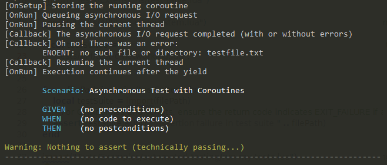

Learn how to create scenarios that involve asynchronous code.

## Motivation

Normally, test suites and scenarios run synchronously. If your code is asynchronous, this won't work.

## Testing Asynchronous I/O

In order to ensure your scenario runs asynchronously, you can use one of these approaches:

1. You could pass control back to the event loop via ``coroutine.yield()``, then ``coroutine.resume()`` later
2. You can set a timeout and let the test runner wait for an asynchronous scenario to complete

The first approach is much simpler, but it can lead to tests never being resumed (and therefore failing).

## Coroutine-based Testing

Whenever your test code yields, the event loop will have a chance to complete pending asynchronous requests. Once the requests are completed, you can simply continue where you left off. Your scenario will appear to run synchronously, with some interruptions. Here's how this could look:

```lua title="async-test-with-coroutines.lua"
-- To demonstrate the effect, this scenario uses libuv primitives directly
local uv = require("uv")

local scenario = Scenario:Construct("Asynchronous Test with Coroutines")

function scenario:OnSetup()
	print("[OnSetup] Storing the running coroutine")
	self.currentThread = coroutine.running() -- Your program/the "user script" is stored here
end

function scenario:OnRun()
	print("[OnRun] Queueing asynchronous I/O request")

	local function onAsyncRequestCompleted(errorMessage)
		print("[Callback] The asynchronous I/O request completed (with or without errors)")
		-- Error handling etc. goes here (omitted for brevity)

		if type(errorMessage) == "string" then
			print("[Callback] Oh no! There was an error:\n\t" .. errorMessage)
		end

		print("[Callback] Resuming the current thread")
		coroutine.resume(self.currentThread) -- Pick up the paused thread and continue with running your test
	end
	uv.fs_open("testfile.txt", "r", 438, onAsyncRequestCompleted) -- This will error if the file doesn't exist, but that's OK

	print("[OnRun] Pausing the current thread")
	coroutine.yield() -- Interrupts execution, to be continued later
	print("[OnRun] Execution continues after the yield")
end

return scenario
```

The test will actually pause until pending requests are completed, with the following output:



Your program will yield to the ``evo`` runtime, which will ``sleep`` until the asynchronous request completes. It then invokes the callback that reinstates your script, which continues as if the interruption had never happened.

## Timeout-based Testing

TBD: Is it actually needed? What scenarios does this cover that can't be worked around otherwise?
