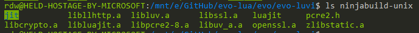
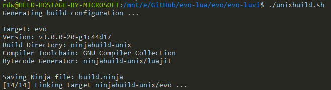

# Building from Source

Learn how to compile the source code into a binary executable

## Prerequisites

### Supported Platforms

The following configurations are "officially supported" (and tested):

* OS: Recent versions of Windows, GNU/Linux, or Mac OS
* Toolchain: GNU Compiler Collection
  * ``gcc`` on GNU/Linux (it's usually preinstalled)
  * ``gcc`` (actually Apple ``clang``) is also preinstalled on Mac OS
  * ``gcc`` on Windows must be provided via MINGW64 (using [MSYS2](https://www.msys2.org/) - standalone won't work!)
  * When using the [Windows Subsystem for Linux](https://learn.microsoft.com/en-us/windows/wsl/install), simply follow the instructions for Unix/OSX

Other operating systems and toolchains might be compatible as well, but no promises there.

### Build Tools

Additional tooling is required, which may or may not be installed on your system already:

* [CMake](https://cmake.org/)
* [Ninja](https://ninja-build.org/)
* Windows only: [MSYS2](https://www.msys2.org/) (use the provided ``bash`` shell, set to ``MINGW64``)

All of the above need to be available in your ``PATH`` or the build process will fail.

:::caution

The default ``gcc`` and ``cmake`` cannot be used in MSYS2.
Instead, install the x86_64 variant, like so:

``pacman -S git make mingw-w64-x86_64-gcc ninja mingw-w64-x86_64-cmake --noconfirm``

The above command, when run in a MSYS2 bash, should install all required tools on Windows.

:::

On Ubuntu (and other Debian-derived distributions), this command should install all the necessary build tools:

``sudo apt update && sudo apt install make cmake ninja-build binutils build-essential --yes``

The above command works on a fresh Ubuntu install and includes the GNU compiler toolchain as well.

## Standard Build Workflow

### Recursive Checkout

Make sure to **recursively** check out the source code to include the required [submodules](https://git-scm.com/book/en/v2/Git-Tools-Submodules):

``git clone https://github.com/evo-lua/evo-luvi.git --recursive``

Afterwards, you should find various third-party dependencies (organized as Git submodules) in the ``deps`` folder.

### Building Dependencies

Before trying to compile the runtime, you must build all of its dependencies at least once. This process can take a while, but you won't have to repeat it unless the dependencies (Git submodules located in ``deps``) have been updated.

If you have all of the required tools installed, simply run the provided shell scripts from the project root:

* On Windows, run ``deps/windowsbuild-all.sh`` **in a MINGW64/MSYS2 shell** (*not* the regular CMD or PowerShell)
* For Unix-like systems, run ``deps/unixbuild-all.sh`` instead **in any bash-like** shell

If all went well, you should find several static libraries (*.a) in the ``ninjabuild-unix`` (or ``ninjabuild-windows``) folder:

:::info

While the all-in-one build scripts are convenient, you can build each dependency individually. Several build scripts following the convention of ``library-platform.sh`` (e.g., ``luajit-unixbuild.sh``) live inside the ``deps`` folder.

:::

It's recommended to only rebuild the dependencies when needed, which should be very rarely (if at all).

### Building the Runtime

Once you have all the dependencies prebuilt, you can compile the runtime itself:

* Windows: Run ``windowsbuild.cmd`` (using the MSYS2 shell is optional here)
* Otherwise, run ``unixbuild.sh`` (using any ``bash``-compatible shell)

Running the script will generate a ``build.ninja`` file with the build description (sans dependencies):

Ninja will compile and link the ``evo`` executable (without rebuilding any dependencies), which you can then run:

Since this process is fast, you can iterate quickly after making changes and rebuild dependencies only as needed.

### Running Tests

You may want to run the unit test suite to exercise the freshly-built executable:

* ``ninjabuild-windows/evo.exe test.lua`` on Windows
* ``ninjabuild-unix/evo test.lua`` on Unixes

Acceptance tests can similarly be run via:

* ``ninjabuild-windows/evo.exe scenarios.lua`` on Windows
* ``ninjabuild-unix/evo scenarios.lua`` on Unixes

Or you could move the executable to somewhere in your ``PATH``, and then omit the ``ninjabuild-*`` prefix.

## Troubleshooting

### Windows Subsystem for Linux

If you just installed WSL and set things up, CMake may fail with an error:

> CMake Error at /usr/share/cmake-3.22/Modules/CMakeTestCCompiler.cmake:85 (configure_file):
>
> Operation not permitted

Solution: [Restart WSL](https://discourse.cmake.org/t/cmake-error-operation-not-permitted-in-new-wsl-ubuntu-session/3681/6) - "It just works!" ;-)

## Alternatives

### GitHub Releases

You can try the [prebuilt releases available on GitHub](https://github.com/evo-lua/evo-luvi/releases) that should work on modern Windows and Mac systems (at least those running on an x64 machine). With Linux, results may vary; this is mostly due to the high probability of running into glibc-related compatibility issues. Thankfully, building is the least painful here and should generally be no problem :)

Variants for other platforms or architectures could be added by popular demand, if it's not a high maintenance burden.

### Legacy CMake Builds

If all else fails, you can check out the last version that still shipped with the [legacy CMake build system](/docs/background-information/design/implemented/build-system-rework.md):

1. ``git checkout v2.18.0``
1. For Linux/Mac OS: ``make regular``
1. On Windows: ``make.bat regular`` (from a [Visual Studio Command Prompt](https://learn.microsoft.com/en-us/visualstudio/ide/reference/command-prompt-powershell?view=vs-2022) if using [MSVC](https://en.wikipedia.org/wiki/Microsoft_Visual_C%2B%2B))
1. The resulting executable is named ``evo-luvi`` (or ``evo-luvi.exe``) instead of ``evo`` (or ``evo.exe``)

It won't have the newest features and is no longer supported, but depending on your use case it might still be enough.
