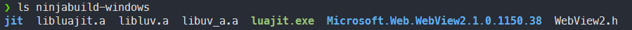
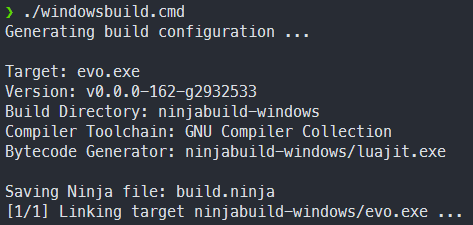

# Building from Source

Learn how to compile the Evo source code into a binary executable

## Prerequisites

### Supported Platforms

The following configurations are "officially supported" (and tested):

- OS: Recent versions of Windows, GNU/Linux, or Mac OS
- Toolchain: GNU Compiler Collection
  - `g++` on Linux is easily installed with your distribution's package manager
  - `g++` is actually Apple `clang` on Mac OS, but it's largely compatible
  - `g++` on Windows must be provided via MINGW64 (using [MSYS2](https://www.msys2.org/) - standalone won't work!)
- When using the [Windows Subsystem for Linux](https://learn.microsoft.com/en-us/windows/wsl/install), simply follow the instructions for Linux builds

Other operating systems and toolchains might be compatible as well, but no promises there.

### Development Environment

A number of tools and libraries need to be installed (and made available in your `PATH`) before you can build the runtime.

#### Windows

The following steps are necessary before you can start the build process:

1. Download and set up a Linux-like [MSYS2](https://www.msys2.org/) environment
1. Use the provided `mingw64.exe` shell, e.g., via start menu: `MSYS2 MINGW64` (requirement for compiling OpenSSL)
1. Install build tools: `pacman -S git make mingw-w64-x86_64-gcc ninja mingw-w64-x86_64-cmake --noconfirm`

The above command, when run in a MSYS2 shell, should install all required tools on Windows.

:::caution

The default `gcc`, `g++` and `cmake` cannot be used in MSYS2.
Instead, you must install the x86_64 variant listed above.

:::

Make sure you have access to the typical Unix tools as well as `ninja`, `cmake`, `gcc`, and `g++` in your terminal before proceeding.

#### Mac OS

A complete setup procedure involves the following steps:

1. Download the [Homebrew package manager](https://brew.sh/)
1. Install Apple's compiler toolchain: `xcode-select --install`
1. Install the required build tools: `brew install git cmake ninja coreutils`

You should be able to execute `gcc`, `g++`, `cmake`, and `ninja` in your terminal before starting the build.

#### Linux

On Ubuntu (and other Debian-derived distributions), this should install all the necessary build tools and development dependencies:

`sudo apt update && sudo apt install make cmake ninja-build binutils build-essential libgtk-3-dev libwebkit2gtk-4.0-dev --yes`

The above command works on a fresh Ubuntu system and includes the GNU compiler toolchain as well as the headers for WebViews.

## Standard Build Workflow

In case of problems: You can always take a look at the [build workflows](https://github.com/evo-lua/evo-runtime/tree/main/.github/workflows) to see all required steps (and the expected results).

### Recursive Checkout

Make sure to **recursively** check out the source code to include the required [submodules](https://git-scm.com/book/en/v2/Git-Tools-Submodules):

`git clone https://github.com/evo-lua/evo-runtime --recursive`

Afterwards, you should find various third-party dependencies (organized as Git submodules) in the `deps` folder.

### Building Dependencies

Before trying to compile the runtime, you must build all of its dependencies at least once. This process can take a while, but you won't have to repeat it unless the dependencies (Git submodules located in `deps`) have been updated.

Once you have all of the required tools installed, simply run the provided shell scripts from the project root:

- On Windows, run `deps/windowsbuild-all.sh` **in a MSYS2 MINGW64 shell** (_not_ the regular CMD or PowerShell)
- For Unix-like systems, run `deps/unixbuild-all.sh` instead **in any bash-like** shell (including the Mac OS X Terminal)

If all went well, you should find several static libraries (\*.a) in the `ninjabuild-unix` (or `ninjabuild-windows`) folder:



:::info

While the all-in-one build scripts are convenient, you can build each dependency individually. Several build scripts following the convention of `library-platform.sh` (e.g., `luajit-unixbuild.sh`) live inside the `deps` folder, alongside other utility scripts.

:::

It's recommended to only rebuild the dependencies when needed, as some of them can take a long time to compile (e.g., OpenSSL).

### Building the Runtime

Once you have all the dependencies prebuilt, you can compile the runtime itself:

- Windows: Run `windowsbuild.cmd` (using the MSYS2 shell is optional here)
- Otherwise, run `unixbuild.sh` (using any `bash`-compatible shell)

Running the script will generate a `build.ninja` file with the build description (sans dependencies):



Ninja will compile and link the `evo` executable (without rebuilding any dependencies), which you can then run:


Since this process is fast, you can iterate quickly after making changes and rebuild dependencies only as needed.

### Running Tests

You may want to run the unit test suite to exercise the freshly-built executable:

- `ninjabuild-windows/evo.exe Tests/unit-test.lua` on Windows
- `ninjabuild-unix/evo Tests/unit-test.lua` on other systems

Some more basic smoke tests can similarly be run via:

- `ninjabuild-windows/evo.exe Tests/smoke-test.lua` on Windows
- `ninjabuild-unix/evo Tests/smoke-test.lua` on other systems

You can also move the executable to somewhere in your `PATH`, and then omit the `ninjabuild-*` prefix.

## Troubleshooting

### Windows Subsystem for Linux

If you just installed WSL and set things up, CMake may fail with an error:

> CMake Error at /usr/share/cmake-3.22/Modules/CMakeTestCCompiler.cmake:85 (configure_file):
>
> Operation not permitted

Solution: [Restart WSL](https://discourse.cmake.org/t/cmake-error-operation-not-permitted-in-new-wsl-ubuntu-session/3681/6)

### Mac OS X Deployment Target

You must set the special environment variable `MACOSX_DEPLOYMENT_TARGET` to a compatible value for the build to succeed. Example:

<!-- ```sh title=build-runtime-and-deps-on-mac-os-monterey.sh -->

```sh title="Building the runtime and its dependencies on Mac OS 12.6 (Monterey)"
MACOSX_DEPLOYMENT_TARGET=12.6 deps/unixbuild-all.sh && ./unixbuild.sh
```

See Apple's [(outdated) documentation](https://developer.apple.com/library/archive/documentation/DeveloperTools/Reference/XcodeBuildSettingRef/1-Build_Setting_Reference/build_setting_ref.html#//apple_ref/doc/uid/TP40003931-CH3-SW129) for details, or the [build workflow for Mac OS](https://github.com/evo-lua/evo-runtime/blob/main/.github/workflows/ci-mac.yml) that contains the version used to create releases.

## Alternatives

### GitHub Releases

You can try the [prebuilt releases available on GitHub](https://github.com/evo-lua/evo-runtime/releases). They should work on all modern x64-based Windows and Mac OS systems.

With Linux, results may vary due to a variety of compatibility issues. Luckily, building is easy here and should generally be no problem.
Releases for other platforms or architectures may be added by popular demand, if and only if the maintenance burden is worth it.
