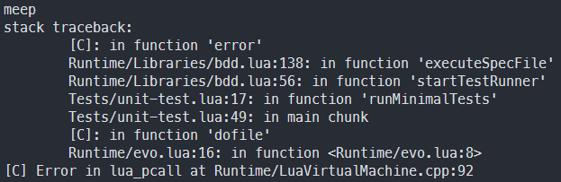
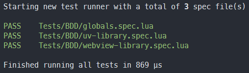
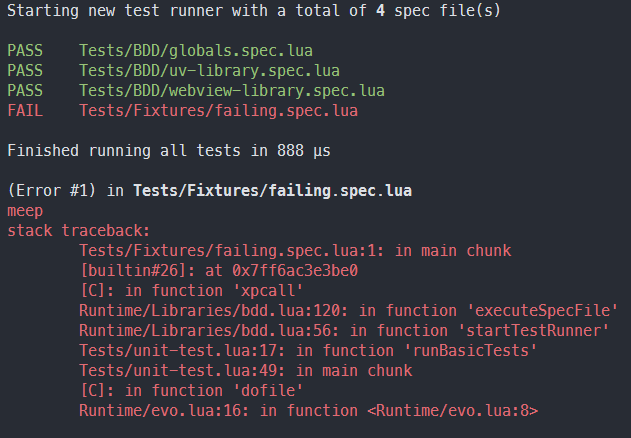
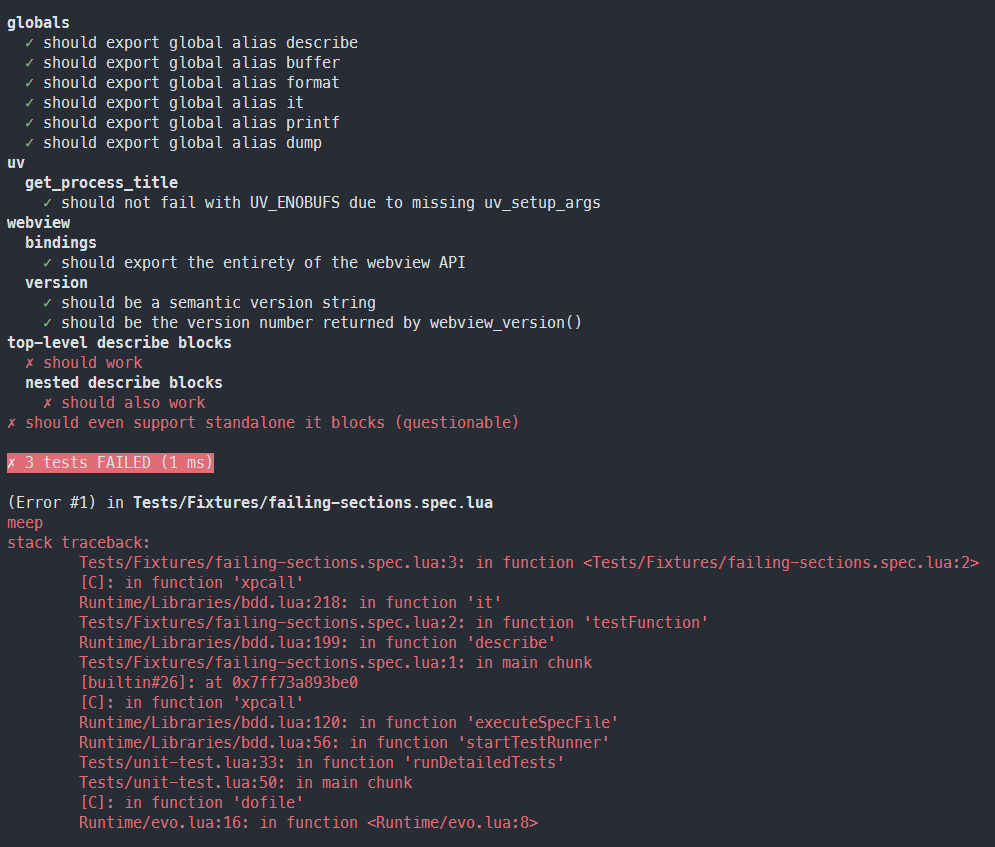

# Unit Testing

Learn how to employ the `bdd` library to run automated unit tests

## The Easy Way

If you don't care about the particulars and just want to run some tests quickly, you can use the same format as the runtime itself:

```lua title=runtime-test-shorthands.lua
local specFiles = {
	"Tests/some-test-file.spec.lua",
	"Tests/another-test-file.spec.lua",
}

local numFailedSections = C_Runtime.RunDetailedTests(specFiles)

-- Exit with a non-zero status to make CI runners fail
os.exit(numFailedSections)
```

This will give you a workable "standard" solution, with the exact configuration that [evo's test suite](https://github.com/evo-lua/evo-runtime/tree/main/Tests) uses. The rest of this document describes more fine-grained options if you wish to build a custom solution, at the cost of having to do a bit more work yourself.

If all you want to do is change the report format, take a look at the other testing shorthands provided by the high-level [Runtime API](/docs/references/api/namespaces/runtime).

## Starting a Test Runner

To manually start a new test runner, you can write a Lua program that passes the list of test files to the `bdd` library:

```lua title=run-some-tests.lua
local bdd = require("bdd")

-- All paths are relative to the current working directory, with POSIX-style path separators
local specFiles = {
	"specs/MyApp.spec.lua",
	"specs/SomethingElse.spec.lua",
}

-- Tell the test runner to execute all of the passed tests (spec = executable specifications)
local numFailedTests = bdd.startTestRunner(specFiles)

-- For CI pipelines: Ensure the return code indicates EXIT_FAILURE if any tests have failed
os.exit(numFailedTests)
```

You can then execute it like any other Lua script:

`evo run-some-tests.lua`

This will give you the most basic of test runners that sets the status code appropriately, with no real error reporting beyond that.

## Writing Unit Tests

Inside the files passed to the `startTestRunner` method, you can implement your test code as a regular Lua program. The test runner will simply execute it and make sure all tests pass, reporting failures (depending on the [reporting mode](#reporting-test-results) set) as soon as they pop up.

### Passing and Failing Tests

The definition for what constitutes a passing or a failing test is quite simple:

- A test (script) _passes_ if it runs to completion when interpreted and executed as a Lua chunk, regardless of its output
- Any script that deliberately throws an error (e.g., by explicitly calling the [error](https://www.lua.org/manual/5.1/manual.html#pdf-error) or perhaps [assert](https://www.lua.org/manual/5.1/manual.html#pdf-assert) function) _fails_ the test
- Needless to say, scripts that accidentally cause the interpreter to raise an error will also fail the test (invalid syntax, ...)

The basic idea is that a test exercises your code and uses [assertions](/docs/references/api/assertions) to raise Lua errors if any assumptions it makes are wrong.

### Examples

Here's some examples for failing tests:

```lua title=failure-due-to-syntax-error.lua
-- Fails with Lua error: '<name>' expected near 'local'
local local = "this is invalid syntax" -- ... because 'local' is a reserved keyword
```

```lua title=failure-due-to-lua-error.lua
local function sayHelloTo(name)
	print("Hello, " .. name .. "!")
end

-- Fails, because Lua raises an error: "attempt to concatenate local 'name' (a nil value)"
sayHelloTo(nil)
```

```lua title=failure-due-to-error-call.lua
local function sayHelloTo(name)
	if not name then
		error("Usage: sayHelloTo(name)")
	end
	print("Hello, " .. name .. "!")
end

-- Fails, because Lua raises an error: "Usage: sayHelloTo(name)"
sayHelloTo(nil)
```

And here, various examples for tests that pass (even if they're not necessarily very useful):

```lua title=success-because-of-noop.lua
-- This program doesn't have any code, but it also doesn't raise any errors...
```

```lua title=success-without-assertions.lua
-- This program doesn't raise any errors, but it's still not very useful as a test
local function sayHelloTo(name)
	print("Hello, " .. name .. "!")
end

-- Passes, because the function prints the text and exits cleanly
sayHelloTo("my little friend")
```

```lua title=success-with-assertions.lua
-- In order to make sure the code behaves as expected, some assertions should be used
local assertions = require("assertions")

local function sayHelloTo(name)
	print("Hello, " .. name .. "!")
end

-- Passes, because the the assertion doesn't raise an error if the function exits cleanly
assertions.assertDoesNotThrow(function()
	sayHelloTo("my little friend")
end)
```

Lastly, this example would be more useful as a "real" test, even if it's still somewhat incomplete:

```lua title=test-with-assertions.lua
local assertions = require("assertions")
local validation = require("validation")

local assertDoesNotThrow = assertions.assertDoesNotThrow
local assertThrows = assertions.assertThrows

local validateString = validation.validateString

local function sayHelloTo(name)
	-- Validation functions will throw an error if the parameter isn't of the expected type
	validateString(name, "name")

	print("Hello, " .. name .. "!")
end

assertDoesNotThrow(function()
	sayHelloTo("my little friend")
end)

assertThrows(function()
	sayHelloTo(nil)
end, "Expected argument name to be a string value, but received a nil value instead")
```

In summary: These examples show that the test runner determines whether a given test failed or passed by checking for errors.

## Organizing Tests

As your test suite grows, it might become difficult to keep things well-organized. Generally speaking, the test runner is unopinionated:

Each file passed to the `startTestRunner` method is considered a separate test. You can load other files to separate a larger test suite into smaller reusable components, and structure your test program any way you prefer. Conceptually, tests are part of a project's architecture, so the `bdd` library doesn't impose artificial constraints on them. This isn't always the most helpful approach, though.

For that reason, `bdd` (which stands for [behavior-driven development](https://en.wikipedia.org/wiki/Behavior-driven_development)) supports executable specifications divided by logical sections.

### Sections and Subsections

Inside any given test file, you can use the following functions to create logically separate blocks:

- [bdd.describe](/docs/references/api/bdd#describe): Shorthand for `bdd.createSection(label, testFunction)`
- [bdd.it](/docs/references/api/bdd#it): Shorthand for `bdd.createSubsection(label, testFunction)`
- Both functions are also available as global aliases, called [describe](/docs/references/api/globals#describe) and [it](/docs/references/api/globals#it)

Using logical partitioning can help you generate more useful reports, but there's no change to how tests are run.

## Reporting Test Results

Test reports can be generated in one of several formats:

- Detailed: Displays a full status report containing all relevant information (this is the default)
- Basic: Displays the number of test files, a simple pass/fail status for each file, and the time taken
- Minimal: Displays nothing, unless there are errors or test failures (Unix style)

You can select the reporting mode before calling [bdd.startTestRunner](/docs/references/api/bdd#starttestrunner) with the following APIs:

- [bdd.setDetailedReportMode](/docs/references/api/bdd#setdetailedreportmode) enables detailed reports (and disables all other report modes)
- [bdd.setBasicReportMode](/docs/references/api/bdd#setbasicreportmode) enables basic reports (and disables all other report modes)
- [bdd.setMinimalReportMode](/docs/references/api/bdd#setminimalreportmode) enables minimal reports (and disables all other report modes)

Let's take a look at some examples next; it will become evident quickly what each mode means in practice.

:::info

Please note that sections and subsections that were created with `describe` and `it` _only_ appear in detailed reports.

:::

### Minimal Reports

This reporting mode is most suitable if you need to reduce the amount of console output displayed (which takes time and adds noise).

#### Minimal report (no failures)


I mean... what did you expect? "Avoid unnecessary output" is the mantra here, and avoid it we shall.

#### Minimal report (with failures)



As you can see, errors are propagated directly. Tests also fail-fast, so that the run ends immediately instead of wasting more CPU cycles.

### Basic Reports

This format is slightly more colorful, and intended to give visual feedback useful to humans without requiring the use of BDD [sections](#sections-and-subsections).

#### Basic (no failures)



#### Basic (with failures)



### Detailed Reports

This is the "fully-featured" and default mode, allowing detailed reports about the individual [sections](#sections-and-subsections) that make up a test suite.

#### Detailed (no failures)


#### Detailed (with failures)



The remaining errors are here omitted for brevity, but all of them will be reported in order.

## Error Propagation

The test runner accumulates error messages and stack traces for each failing test (and section/subsection).

You can fetch them by calling [bdd.getErrorDetails](/docs/references/api/bdd#geterrordetails) after the test run has finished:

```lua title=print-error-details.lua
local bdd = require("bdd")

local specFiles = {
	"some-test.spec.lua",
	"another-test.spec.lua",
}

bdd.startTestRunner(specFiles)

local errorDetails = bdd.getErrorDetails()
for index, errorInfo in ipairs(errorDetails) do
	print(index, errorInfo.specFile, errorInfo.message, errorInfo.stackTrace)
end

-- Alternatively, dump everything if you want more details (e.g., to log to a file)
dump(errorDetails)
```

Error details are collected regardless of reporting mode, but they aren't displayed automatically to reduce visual clutter.

## Alternatives

If you need more advanced features not offered by the builtin test runner, consider using libraries like [busted](https://github.com/Olivine-Labs/busted) or [luaunit](https://github.com/bluebird75/luaunit).
