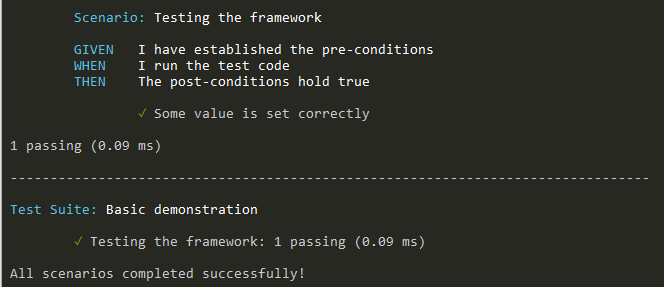

Learn how to use the builtin testing framework in your application.

## TODOs

:::danger Important stuff is still missing here

* Link to auto-generated API docs for the testing primitives
* Add automated testing for the code snippets
* Link to downloadable example repository
* Actually embed ``RedGreenRefactor`` into the ``evo`` runtime
* Implement the spec file parser and embed it, too
* Implement the assertion library
* Split into multiple docs, one per docType

:::

## Installation

The ``evo`` runtime ships with a builtin testing framework. You don't have to install anything to use it; it's just there.

## Testing Methodology

The framework roughly follows the [behavior-driven development](https://en.wikipedia.org/wiki/Behavior-driven_development) philosophy. With this style of testing, you can create test suites for each component or subsystem under test. Then, you can add one more scenarios that represent actual use cases (from an end-user perspective) to the test suite and run them all. All of this happens in code; there's no [DSL](https://en.wikipedia.org/wiki/Domain-specific_language).

## Global Testing Primitives

The following testing primitives are exported to the global environment:

* ``TestSuite`` with the following API:
  * ``Construct(name)``
  * ``AddScenario(scenario)``
  * ``RunScenario(scenario)``
  * ``RunAllScenarios()``
  * ``PrintSummary()``
* ``Scenario`` with the following API:
  * ``Construct(name)``
  * ``Run()``
  * ``PrintResults()``
  * ``GetName()``
  * ``GetResultsText()``
  * ``GetNumFailedAssertions()``
  * ``HasFailed()``
  * ``GIVEN(description, establishPreconditions)``
  * ``WHEN(description, runTestCode)``
  * ``THEN(description, assertPostconditions)``
  * ``FINALLY(cleanupCode)``

Capitalized functions are the [BDD](https://en.wikipedia.org/wiki/Behavior-driven_development) primitives. Most should be self-explanatory, but let's check out a short example next.

## Writing and Running Tests

Here's a simple script that defines a test suite with just one scenario and immediately executes the spec:

```lua title="bdd-demo.lua"
    local Example = {}

	function Example:Execute()

		local testSuite = TestSuite:Construct("Basic demonstration")
		local scenario = Scenario:Construct("Testing the framework")

		scenario:GIVEN(
			"I have established the pre-conditions",
			function()
				-- This function should run all setup code ("establish preconditions" for the test)
			end
		)

		scenario:WHEN(
			"I run the test code",
			function()
				-- This function should run the code under test
				self.someValue = 42
			end
		)

		scenario:THEN(
			"The post-conditions hold true",
			function()
				-- This function should assert the expected post-conditions
				assert(self.someValue == 42, "Some value is set correctly")
			end
		)

		scenario:FINALLY(function()
			-- Cleanup tasks; this won't be displayed in the final report
		end)

		testSuite:AddScenario(scenario)
		testSuite:RunAllScenarios()

	end

	Example:Execute()
```

You can run your tests like any other script, by invoking the interpreter on your scenario file: ``evo bdd-demo.lua``

The displayed summary of the above script should read as follows:



The API is optimized for readability and quite verbose. Don't worry, there's an easier way to create these kinds of tests!

## JSON Spec Files

You can also create a ``specs.json`` file that stores the layout of one or multiple test suites, with all scenarios and descriptions but absolutely none of the boilerplate code. Here's how this would look for the above example:

```json title="specs.json"
	[
		{
			"name": "Basic demonstration",
			"scenarios": [
				{
					"name": "Testing the framework",
					"given": "I have established the pre-conditions",
					"when": "I run the test code",
					"then": "The post-conditions hold true",
					"script": "Tests/BasicDemonstration/TestingTheFramework.lua"
				}
			]
		}
	]
```

Now, simply create a file ``Tests/BasicDemonstration/TestingTheFramework.lua`` (starting **at the root directory of your package**, i.e., where ``specs.json`` should be located) and add the actual test code that is to be executed:

```lua title="Tests/BasicDemonstration/TestingTheFramework.lua"

	function GIVEN()
		-- This function should run all setup code ("establish preconditions" for the test)
	end

	function WHEN()
		-- This function should run the code under test
		self.someValue = 42
	end

	function THEN()
		-- This function should assert the expected post-conditions
		assert(self.someValue == 42, "Some value is set correctly")
	end

	function FINALLY()
		-- Cleanup tasks; this won't be displayed in the final report
	end

```

Once done, you can run test suites via ``epo test <TestSuite> <Scenario>``, where the angle brackets denote placeholders that refer to the ``name`` field in ``specs.json``. Omitting the scenario name will run all scenarios for the suite, and omitting the suite will run all tests found in the spec file. Use quotes if needed: ``epo test "Basic demonstration"``

Unfortunately, there's no getting around writing *some* code here. But hopefully, minimizing boilerplate and gathering all test specs in a standardized location will take some of the pain out of writing well-structured, readable tests.


## Assertion Library

As part of the ``bdd`` library, commonly-used assertions are also exported globally:

* ``assertTrue``
* ``assertFalse``
* ``assertEquals``
* ``assertNotEquals``
* ``assertDeepEquals``
* ``assertNil``
* ``assertNotNil``
* ``assertTypeOf``
* ``assertThrows``
* ``assertApproximatelyEquals`` (for float comparisons)
* ``assertNotApproximatelyEquals`` (for float comparisons)

These are just shorthands, but they work with the testing framework to produce human-readable error messages.

## Limitations

As with every other design for a testing framework, there are some drawbacks to consider:

* Nested hierarchies of tests are not supported, although you can of course organize each ``Scenario`` however you like
* You must write textual descriptions for all test suites and scenarios and their ``name`` must must be unique
* Asynchronous tests (using callbacks) aren't currently supported, though you can use [coroutines](https://www.lua.org/pil/9.1.html) if you need this

If you need more features or you dislike the structure that writing BDD-style tests imposes, there may be other options.

## Alternatives

There's obviously no need to use the provided testing primitives if you don't want to. Any standard Lua testing framework, such as [busted](https://github.com/Olivine-Labs/busted) or [LuaUnit](https://luarocks.org/modules/bluebird75/luaunit), should work as long as it only uses Lua 5.1 and [supported Lua 5.2 features](https://luajit.org/extensions.html). You could even create your own test runner, or use a native (C/C++) framework via LuaJIT's [foreign function interface (FFI)](https://luajit.org/ext_ffi.html).

However, the builtins described here are "officially" maintained. They're guaranteed to see updates when changes to the runtime and the environment necessitate it, while all other solutions are likely to require maintenance on your part.

If you're unhappy with the framework, please open an issue or otherwise give feedback to help make it better!
